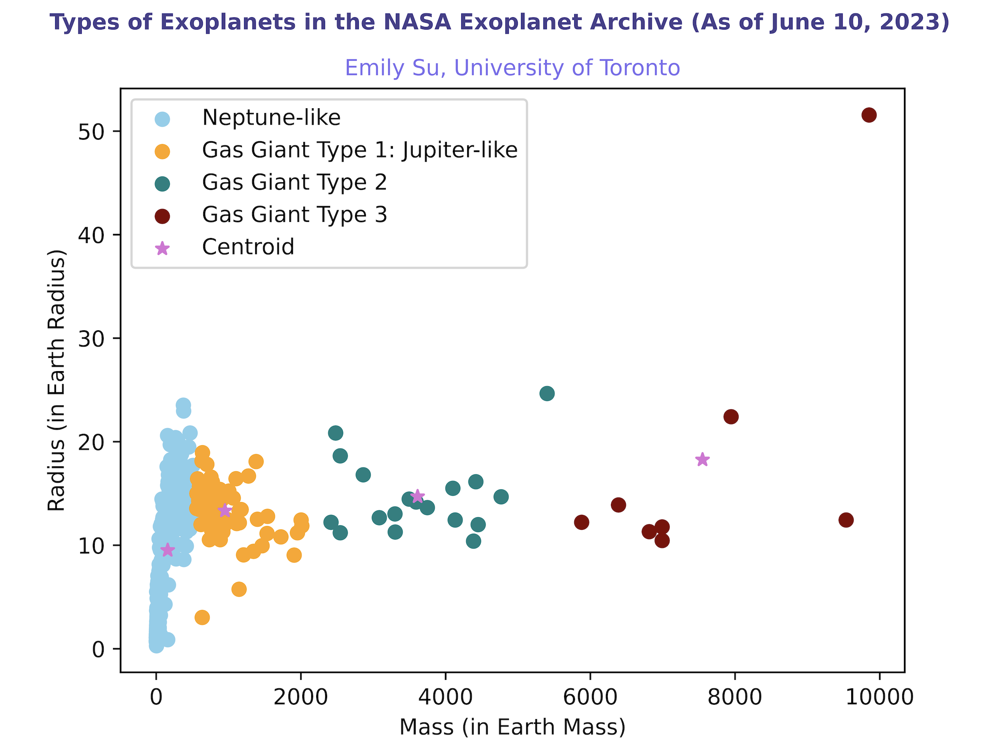

# Exoplanet Classifier and Safronov Number
In the notebook, we will look at the different exoplanets in the NASA Exoplanet Archive as of June 10, 2023. First and foremost, use the k-means clustering algorithm to classify them into different types. Next, calculate their Safronov numbers to measure their ability to eject bodies like planets out of their planetary system (McDonald & Veras, 2023; Safronov, 1972). We want to observe the relationship between the type of exoplanet and its Safronov number and determine the capabilities of certain types of exoplanets scattering bodies found in their planetary system. We will use Python, scikit-learn, Pandas, Matplotlib, and NumPy.

