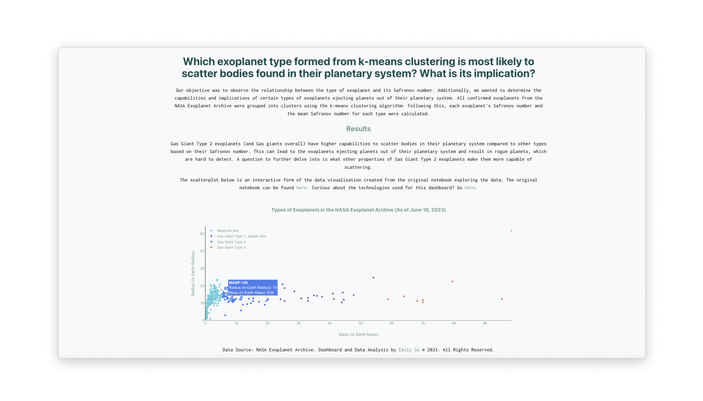

# Exoplanet Classifier and Safronov Number
Which exoplanet type formed from k-means clustering is most likely to scatter bodies found in their planetary system? What is its implication?

We will look at the different exoplanets in the NASA Exoplanet Archive as of June 10, 2023. First and foremost, exoplanets are classified using the k-means clustering algorithm into different types. Next, the exoplanets' Safronov numbers are calculated to measure their ability to eject bodies like planets out of their planetary system (McDonald & Veras, 2023; Safronov, 1972). We want to observe the relationship between the type of exoplanet and its Safronov number and determine the capabilities and implications of certain types of exoplanet scattering bodies found in their planetary system.

## Technologies Used
Python, scikit-learn, Pandas, Matplotlib, and NumPy was used to conduct the data analysis. React, Vite, JSX, CSS, and Plotly was used to build the data visualization dashboard.

# References
Catriona, H. M., & Veras, D. (2023). Binary asteroid scattering around white dwarfs. Monthly Notices of the Royal Astronomical Society, 520(3), 4009–4022, https://doi.org/10.1093/mnras/stad382

Safronov, V. S. (1972). Evolution of the protoplanetary cloud and formation of the earth and the planets. Keter Publishing House.
